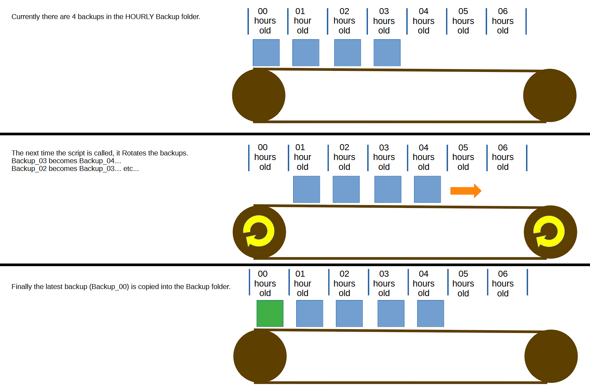

# mcbu
Minecraft Server backup script

This script will perform HOURLY and DAILY backups.

The instructions are in the comments to setup folder structure and crontab to delete DAILY backups older than 30 days.

Make mcbu.sh executable : chmod +x mcbu.sh
